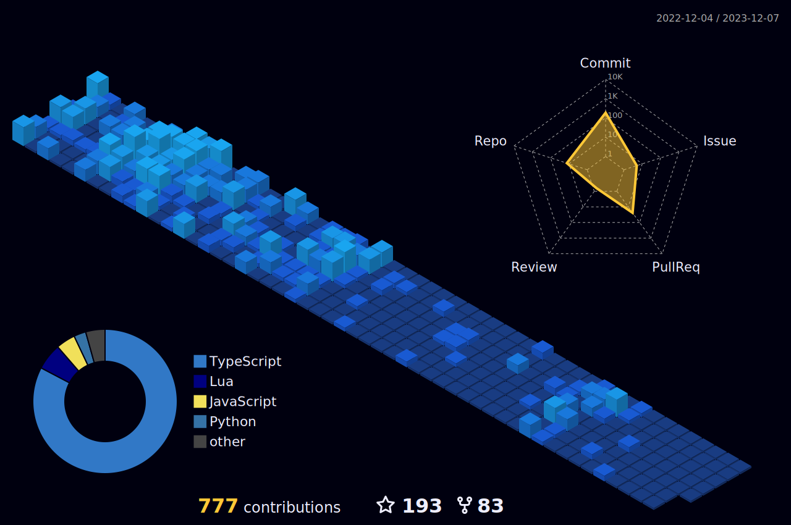

Greetings! I am Nick, a dedicated software engineering student on a journey to explore the vast realms of technology. As a burgeoning software engineer, my focus lies in the intricate world of Discord bot development,FiveM, RageMP, and web development, where I bring virtual entities to life with functionality and flair. It's worth mentioning that I take pride in my achievements. I created a GTA5 FiveM server called Thrilokam Roleplay, and it was nice work done by me and my friends. We also created another GTA5 roleplay server based on RAGE MP called Signature (SOUTH INDIA FIRST SERVER), as I hold the distinction of developing a verified Discord bot, a testament to the quality and reliability of my creations.

  

 **Information:**

- 🔭 I’m currently working on  **Open Source Projects and Discord Bots.**
- 🌱 I’m currently learning  **React.JS, Lua, Js and C++.**
- 💬 Ask me about  Anything related to **FIVEM & RageMP.**
- 📫 Contact me at :  **DISCORD Nick OP#6063**
- 😄 Pronouns :  **He/Him.**

        </a>
        </a>
        </a>
        </a>
        </a>
        </a>

